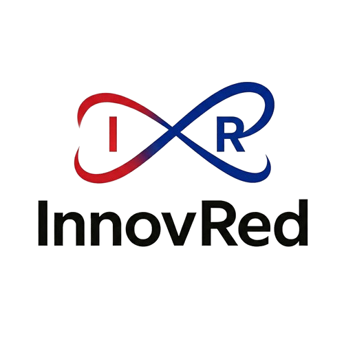

# Livan Torres - Professional Portfolio ✨



An interactive, multi-language professional developer portfolio designed to showcase my experience, skills, and projects as a **Systems Engineer and Backend PHP Specialist**.

This project was built with a strong focus on modern UI/UX principles, featuring fluid animations, an immersive dark/light theme, and a fully responsive layout.

## 🚀 Key Features

- 🌐 **Native Multi-language Support:** Seamlessly switch between English, Spanish, and Portuguese without reloading the page.
- 🌓 **Dynamic Theming:** Intelligent Light / Dark mode toggling built on top of `next-themes` and Tailwind CSS.
- ✨ **Fluid Animations:** Advanced animations, scrolling effects, and 3D transitions powered by `framer-motion`.
- 📱 **Fully Responsive:** Carefully crafted layouts that look perfect on mobile, tablet, and desktop devices.
- 🎯 **Premium UI/UX:** Built using modern glassmorphism, subtle gradients, and highly professional visual hierarchy.

## 🛠️ Tech Stack

- **Framework:** [Next.js](https://nextjs.org/) (App Router)
- **Library:** [React](https://reactjs.org/)
- **Styling:** [Tailwind CSS](https://tailwindcss.com/)
- **Animations:** [Framer Motion](https://www.framer.com/motion/)
- **Language:** [TypeScript](https://www.typescriptlang.org/)
- **Icons:** [Lucide React](https://lucide.dev/)

## 💻 Getting Started

First, clone the repository and install the dependencies:

```bash
git clone https://github.com/yourusername/livan-portfolio.git
cd livan-portfolio
npm install
```

Then, run the development server:

```bash
npm run dev
```

Open [http://localhost:3000](http://localhost:3000) with your browser to see the result.

## 👤 Author

**Livan Torres Núñez**
- Role: Systems Engineer | Backend PHP Specialist
- Location: Montería, Colombia

---
*If you like this project, feel free to give it a ⭐!*
